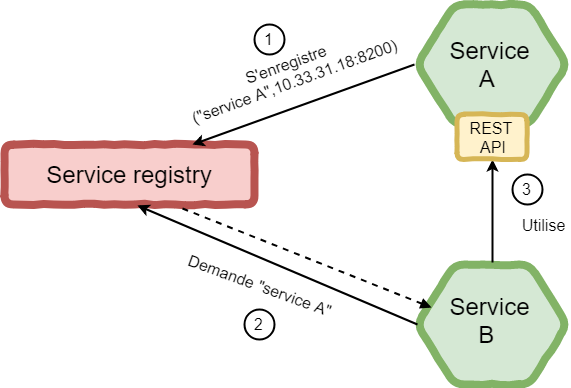
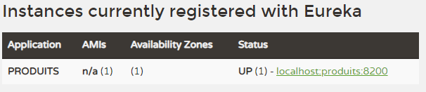

= Service discovery =

== Principe == 
----
Un service discovery est un annuaire des services (REST) d'une application organisée en mode microservice.
----

<1> Un *Service A* se déclare auprès du _service registry_ en indiquant son nom, son url et le port.
<2> Un *Service B* souhaitant utiliser *Service A* demande au _service registry_ ou se trouve le *Service A*.
<3> Ayant l'adresse du *Service A*, *Service B* peut effectuer sa demande.

== Mise en oeuvre avec Spring boot (Cloud) ==

=== Présentation du contexte _métier_ ===

Un système avec deux services :

* Un service en charge des _produits_.
* Un service en charge des _commandes_.

Le service _commandes_ a besoin de s'adresser au service _produits_ pour obtenir plus d'informations.

Le service _produits_ va exposer un service en charge de fournir les informations de base :

[source,rest]
----
/produit/{code produit} : Produit
----

=== Librairies utilisées ===

* _Spring boot_ :  framework bien connu permettant de mettre rapidement en oeuvre des microservices.
* _Eureka_ : librairie créée par *Netflix* et implémentant le principe des  _service discovery_.
* _Maven, git_ : organisation des sources

Dans cette première version, on ne parle pas de _Docker_.

=== Création des projets maven ===

On va créer 3 projets en utilisant le site _https://start.spring.io/_ pour initialiser chacun des projets maven.

* *Service Registry* sera le serveur contenant le service d'enregistrement. Ses dépendances seront _Web_, _Eureka server_, _Dev Tools_.
* *Produits*  sera le module en charge des produits. Il possède (en théorie) la base de données des produits, les règles métiers et expose un certain nombre de services rest. Ses dépendances seront _Web_, _Eureka discovery_, _Dev tools_.
* *Commandes* sera le module en charge des commandes. Il possède (en théorie) la base de données des commandes, les règles métiers et expose (potentiellement) un certains nombre de services rest. Ses dépendances seront _Web_, _Eureka discovery_ et _Dev tools_.

Le site fournit alors 3 zip qui constituent les projets. Les décompresser et executer un _mvn package_ dans les répertoires.

=== Module service-registry === 

Il s'agit du serveur d'enregistrement des services. 

Seulement 2 choses à effectuer.

==== Ajout de l'annotation pour déclarer le serveur ====

Dans la classe _*Application*_ de ce projet, il faut ajouter l'annotation _@EnableEurekaServer_

[source,java]
----
@EnableEurekaServer
public class ServiceregistryApplication {

	public static void main(String[] args) {
		SpringApplication.run(ServiceregistryApplication.class, args);
	}
}
----

Cette simple annotation transforme la classe en un serveur *Eureka*.

Il reste à le configuer.

==== Configuration du serveur ====

Il faut ajouter certaines informations dans le fichier _application.properties_ typique d'une application _Spring boot_

.fichier application.properties
[source]
----
# On donne un nom au serveur
spring.application.name=eureka-server

# port par défault du serveur Eureka
server.port=8761

#Par default, eureka va s enregistrer lui même comme client.
#Il faut donc positionner certaines propriétés à false.

eureka.client.register-with-eureka=false
eureka.client.fetch-registry=false
----

Et voilà, le serveur est prêt.

=== Module Produits ===

Ce module va  exposer un service Rest et s'enregistrer auprès du service-registry.

==== Client ====

Cette fois ci le module n'est pas un module serveur mais est client du service registry.

Il faut le déclarer en tant que tel via une annotation issue du module eureka-client : _@EnableEurekaClient_

[source,java]
----
@SpringBootApplication
@EnableEurekaClient	// Enable eureka client. It inherits from @EnableDiscoveryClient.
public class ProduitsApplication {

	public static void main(String[] args) {
		SpringApplication.run(ProduitsApplication.class, args);
	}
}
----
Lorsqu'un client s'enregistre avec Eureka, il fournit des informations sur lui même telles que un host, un port, une URL pour vérifier sa santé.

Eureka recoit des messages de  chaque instance appartenant à un service. Si le message échoue dans un certains délai, l'instance est supprimée de l'annuaire.

==== Configuration ====

Il faut indiquer le nom sous lequel les services de ce module seront accessibles.
Pour cela dans le contexte, _bootstrap.properties_, il fait préciser le nom de l'application.

.Configuration du nommage des services dans _bootstrap.properties_
[source,yml]
----
spring.application.name=produits
----

Tous les services du modules _Produits_ seront accessibles via ce nom.

Il faut ensuite indiquer ou se trouve le serveur _Eureka_ et déclarer le port de ce module.

.application.properties
----
# port
server.port=8200
# eureka server url
eureka.client.serviceUrl.defaultZone=http://localhost:8761/eureka <1>
----

<1> Rappelez vous, le port du service eureka est bien 8761.

A ce stade, il manque le principal, le(s) service(s) rest.

==== Controller ====

Ce controleur va contenir un service renvoyant un produit en fonction du code demandé.

[source,java]
----
@RestController
public final class ProduitController {

    @RequestMapping("/produit/{codeProduit}")
    Produit getProduit( @PathVariable String codeProduit) {
        return new Produit(100L, codeProduit, "Produit", 100.0);
    }
}
----

A l'uri _/produit/{codeProduit}_ le service va renvoyer un détail du produit.

.Appel du service
----
http://localhost:8200/produit/10002

{"id":100,"codeProduit":"10002","libelleProduit":"Produit","poids":100.0}
----

A l'adresse _localhost:8761_ on peut voir le service actif.

=== Module Commandes ===

Ce module va appeler le service REST créé dans le module Produits.
Pour cela, on ne devra pas lui indiquer l'(url,port) du module Produit, on va passer par le serveur Eureka pour réaliser l'appel.

Une service de type GET, à l'uri  _(/commandes)_ permet d'obtenir une liste de commandes. Pour chaque commande, on a besoin du libellé du produit qui est connu uniquement par le module _Produit_.

Pour chaque commande (qui contient uniquement un produit), on appelle le service sur le module _Produit_ permettant d'obtenir les informations produits.

==== Client Eureka ====

Ce module est également un client Eureka. L'annontation _@EnableEurekaClient_ est donc également à positionnée sur la classe principale

.Classe principale CommandesApplication 
[source,java]
----
@SpringBootApplication
@EnableEurekaClient
public class CommandesApplication {
    public static void main(String[] args) {
		SpringApplication.run(CommandesApplication.class, args);
	}
}
----

Cette application sera donc déclarée au niveau du service discovery.

La configuration se fait dans les fichiers properties.

.Fichier bootstrap.properties pour le nom du service
[source,java]
----
spring.application.name=commandes
----

.Fichier application.properties pour les variables globales
[source,java]
----
# port
server.port=8300
# eureka server url
eureka.client.serviceUrl.defaultZone=http://localhost:8761/eureka
----
Le port du service ici est différent des deux précédents. On remet l'url du serveur Eureka.

==== Client Rest ====

Pour appeler les services Rest du module Produits, on configure un client Rest

.Déclaration du client REST, 
[source,java]
----
@Configuration
public class RestClientConfiguration {
    @Bean
    @LoadBalanced
    public RestTemplate restTemplate(RestTemplateBuilder builder) {
        return builder.build();
    }
}
----

L'annotation _@LoadBalanced_ est indispensable ici (_Ribbon ?_)

==== Le service REST /commandes ====

Il va être nécessaire de mettre en place un controleur pour y définir le point d'entrée du module commande.

Cette classe ne contiendra aucun métier, celui-ci est défini dans une classe Service injecté dans le controleur.

.Définition de la classe controleur
[source,java]
----
@RestController
public final class CommandesController {
    @Autowired
    private  CommandeService commandeService;

    @RequestMapping("/commandes")
    public List<Commande>  getCommandes() {
        return commandeService.getCommandes(); <1>
    }
}
----
<1> L'appel Rest déclenche un appel de la classe Service du composant commande.

.Définition de l'interface de la classe de service
[source,java]
----
public interface CommandeService {
    /**
     * Return a list of commandes
     * @return
     */
    public List<Commande> getCommandes();
}
----

Rien de bien compliqué, juste un peu d'architecture propre.

L'implémentation de cette classe est plus intéressante car elle va mettre en oeuvre un appel de service rest en utilisant le service discovery.
[source,java]
----
@Service
public class CommandeServiceImpl implements CommandeService {
   
    private final RestTemplate restTemplate;<1>
    private String produitHost;<2>
    @Autowired
    public CommandeServiceImpl(final RestTemplate restTemplate,@Value("${produitHost}") final String produitHost) {
        this.restTemplate = restTemplate;
        this.produitHost = produitHost;
    }

    public List<Commande> getCommandes() {<3>
     List<Commande> commandes = Arrays.asList(new Commande(1L,"100101","100",null),
                                              new Commande(2L,"100101","1210",null));<4> 
      
     // need to complete commande with the field libelleProduit of produit.
     commandes.stream().forEach(commande -> {
         Produit produit = restTemplate.getForObject(produitHost+"/produit/"+commande.getRefProduit(), Produit.class);<5>
        commande.setLibelleProduit(produit.getLibelleProduit());
        });
     return commandes;
    }
}
----

<1> Le client rest pour appeller les services rest. En réalité, l'implémentation de cette classe provient de Eureka (ou Ribbon). Elle sait donc s'adresser à Eureka.
<2> Une variable contenant l'host des services du composant produit. Elle est définie dans le fichier _application.properties_. Elle est valorisée par spring boot via le constructeur.
<3> Implémentation du service
<4> On mock la liste des commandes
<5> Appel REST vers le module _Produits_ en passant par le serveur Eureka. On dispose du host et on ajoute le _produit_. On indique le type de classe en retour. 

.Définition du host du module _Produits_ dans le fichier _application.properties_.
[source,java]
----
# host for the produits services
produitHost=http://produits
----
Le host est en réalité le som de l'application définie dans le fichier _bootstrap.properties_. 

Les beans (_Produit_ et _Commande_) sont définis dans ce module.

[source,java]
----
@Getter
@Setter
@AllArgsConstructor
/**
* Commande bean
*
*/
public final class Commande {

    private Long id;
    private String codeCommande;
    private String refProduit;
    private String libelleProduit;

}

@Getter
@Setter
@AllArgsConstructor
/**
*
* Produit bean
*/
public final class Produit{

    private Long id;
    private String codeProduit;
    private String libelleProduit;
    private Double poids;

}
----

==== Test ====

Depuis un navigateur, il est possible d'appeler le service de commandes (http://localhost:8300/commandes).
Cette appel entraîne un appel au service des produits.
Si dans le navigateur, en retour de l'appel un objet json s'affiche c'est que les appels ont bien eu lieu
[source,json]
----
[{"id":1,"codeCommande":"100101","refProduit":"100","libelleProduit":"Produit"},{"id":2,"codeCommande":"100101","refProduit":"1210","libelleProduit":"Produit"}]
----
