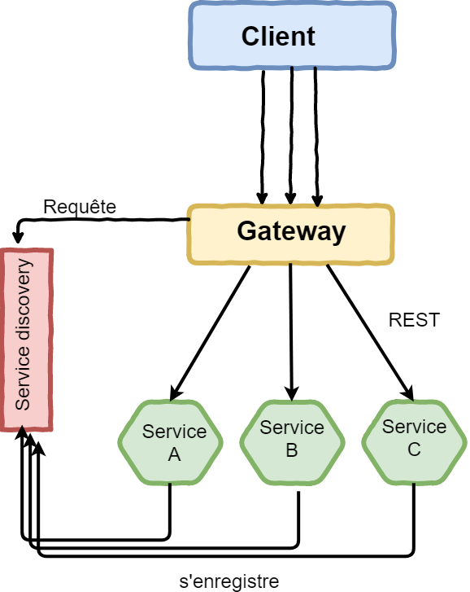
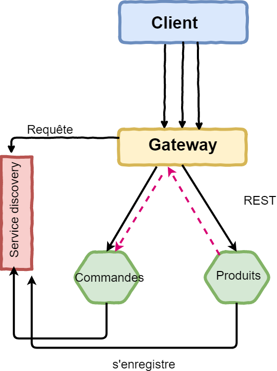

= Gateway : Zuul arrive =

Lorsque l'on appelle un service depuis le navigateur, on ne peut pas utiliser les même nom de service que pour Eureka.
Il faut absolument préciser le port, l'url. Si l'on augmente le nombre d'instances, chacune avec sont propre port, cela devient difficile à gérer pour le client.

Comment distribuer les appels sur les différents ports depuis le client ?

Une solution commune est *la Gateway*

----
Une gateway est un point d'entrée unique dans le système, utilisé  pour gérer les requêtes en les routant vers les bons services. Elle peut également être utilisée pourle monitoring, authentification et plus encore...
----

Lors d'un appel REST, la gateway demande au serveur "servicediscovery" de lui donner l'adresse du service entrant en se basant sur un mapping prédéfini entre l'uri et le nom du service. Comme tous les services se sont préalablement enregistrés, la gateway est en mesure de rediriger correctement les appels entrants.

== Création du module ==

Pour ajouter la gateway, il faut créér un module spécifique. Comme pour les précédents cela passe par le site de spring.
Les dépendances minimum sont Web,Eureka client, Zuul et devtools.

== Paramétrage de la gateway ==

Il faut d'abord configurer la classe d'application de spring en ajoutant la traditionnel annotation _@EnableEurekaClient_ pour que la gateway s'enregistre auprès du serveur de servicediscovery.

Le nom de la librairie qui contient la gateway porte le nom de Zuul. L'initialisation de la gateway consiste à ajouter l'annotation _@EnableZuulProxy_.

[source,java]
----
@SpringBootApplication
@EnableEurekaClient
@EnableZuulProxy
public class GatewayApplication {

	public static void main(String[] args) {
		SpringApplication.run(GatewayApplication.class, args);
	}
}
----

Cela ne fait que démarrer la gateway, il faut maintenanty faire le routing.

Il faut pour cela indiquer les différentes routes et le lien vers les services dans le fichier application.yml (yaml plus pratique ici)

.application.yml
[source,yml]
----
server:
  port: 8000 <1>
zuul:
  ignoredServices: '*'
  prefix: /api <2>
  routes:
    commandes: <3>
      path: /commandes/** <4>
      serviceId: commandes <5>
      strip-prefix: false
    produits: 
      path: /produits/**
      serviceId: produits
      strip-prefix: true <6>
endpoints:
  routes:
    sensitive: false
eureka:
  client:
    serviceUrl:
      defaultZone: http://localhost:8761/eureka/ <7>
----

<1> On définit comme d'habitude le port d'entrée de la gateway.
<2> Il est possible de définir un préfixe obligatoire pour accéder à la gateway
<3> Chaque route est identifiée par un nom unique
<4> Il faut indiquer la racine de l'uri permettant d'identifier la route.
<5> on indiquer vers quel service rediriger l'appel (nom du service dans Eureka).
<6> lorsque l'url _/produits/produit/{id}_ est appelée, le _/produits/_ est supprimée.
<7> Bien sur, il faut déclarer eureka, la gateway l'utilisant pour résoudre les urls.

Dans le fichier, _bootstrap.properties_, il faut donner un nom à cette application.

.bootstrap.properties
[source,properties]
----
spring.application.name=gateway
----

== Tout doit passer  par la gateway ==

Dans la configuration actuelle du module _Commandes_, l'appel avec le module _Produits_ se fait sans passer par la gateway. 

.application.properties du module _Commandes_
----
produitHost=http://produits
----
La mise en place de l'appel par la gateway se fait en remplacant la valeur par l'url de la gateway

----
produitHost=http://localhost:8000/api/produits
----

L'utilisation de la valeur true pour la propriété _strip-prefix_ prend tout son sens.

== CORS ==
Il reste un souci, pour accéder à la gateway de l'extérieur en se situant sur un serveur différent (angular ou architecture différente), il faut paramétrer CORS 

[source,java]
----
@Configuration
@EnableWebMvc
public class WebConfiguration extends WebMvcConfigurerAdapter {
    /**
     * Enable cross origin Ressources sharing
     */
    @Override
    public void addCorsMappings(final CorsRegistry registry) {
        registry.addMapping("/**");
    } 
}
----

Cette étape n'est obligatoire lorsque on accède aux services depuis le navigateur avec localhost ou l'ip de la machine Docker.
Elle devient nécessaire dans le cas d'un serveur qui hébergerait une application WEB.

== TEST ==

Pour tester le bon fonctionnement de cette architecture, il faut appeler l'url d'Eureka (localhost:8761)
pour vérifier que la gateway s'est bien enregistré aurpès d'Eureka.

Enfin, il faut tester le service REST du module _commandes_, en appelant l'uri _localhost:8000/api/commandes_ .

