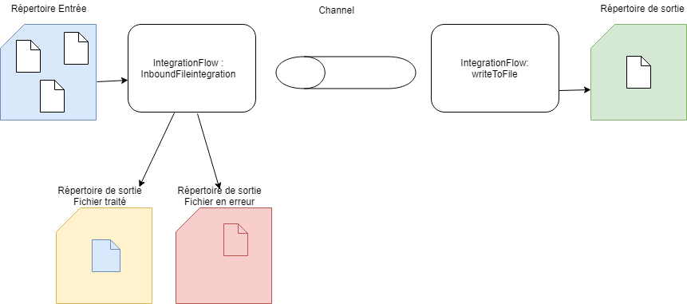
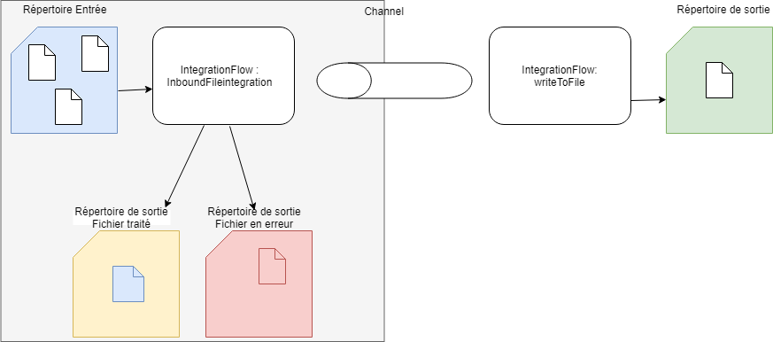
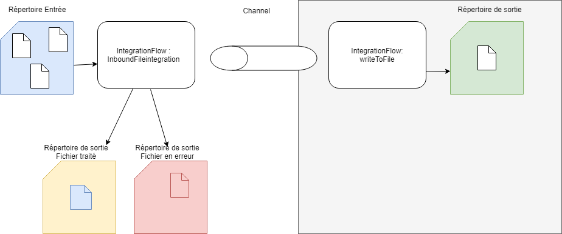

= Integration de fichiers externes =

----
Ici, Spring va être utilisé pour mettre en place un système capable de traiter des fichiers déposés dans un répertoire.
Chaque fichier va subir un traitement particulier (très simple).
----

== Le workflow ==

Le système qui va être mis en place est le suivant :

    * Un répertoire dans lequel on dépose des fichiers à traiter
    * Définition d'un traitement de base (ici inversion de la chaine de caractère)
    * Le fichier qui va être traité est déplacé dans un répertoire "Processed"
    * Le fichier après traitement est créé dans un répertoire "Out"
    * En cas d'erreur le fichier est copié dans un répertoire "Failed".
    
Tout cela est mise en place en utilisant Spring itnegration, qui fournit un ensemble de classe pour mettre en place un flux de traitement.

== Définition des répertoires ==

Les fichiers traités ne sont pas conservés dans le répertoire d'origine.
Au fil du traitement ils vont être déplacés dans différents lieux :

* _InboundReadDirectory_ : Répertoire ou sont lus les fichiers.
* _ProcessedDirectory_ : Répertoire ou les fichiers traités sont déplacés. Il s'agit la du fichier original, sans transformation.
* _InboundOutDirectory_ : Répertoire ou le fichier transformé est déposé.
* _InboundFailedDirectory_ : Répertoire ou le fichier est déposé en cas de problème lors du traitement.

[source,java]
----
@Configuration
public class FilePollingConfiguration {

    @Bean(name="inboundReadDirectory")
    public File inboundReadDirectory(@Value("${inbound.read.path}") String path) {
        return makeDirectory(path);
    }

    @Bean(name="inboundProcessedDirectory")
    public File inboundProcessedDirectory(@Value("${inbound.processed.path}") String path) {
        return makeDirectory(path);
    }

    @Bean(name="inboundFailedDirectory")
    public File inboundFailedDirectory(@Value("${inbound.failed.path}") String path) {
        return makeDirectory(path);
    }

    @Bean(name="inboundOutDirectory")
    public File inboundOutDirectory(@Value("${inbound.out.path}") String path) {
        return makeDirectory(path);
    }

    private File makeDirectory(String path) {
        File file = new File(path);
        file.mkdirs();
        return file;
    }

}
----
Ils sont définis à l'aide de _Bean_, et de valeurs définies dans le fichier _application.yml_. Si les répertoires n'existent pas ils seront automatiquement créés.

.application.yml
[source,java]
----
inbound:
    failed:
        path: inbound/failed
    file:
        poller:
            fixed:
                delay: 1000
            max:
                messages:
                    per:
                        poll: 5
            thread:
                pool:
                    size: 4
    filename:
        regex: ([^\s]+(\.(?i)(txt))$)
    out:
        path: inbound/out
    processed:
        path: inbound/processed
    read:
        path: inbound/read
out:
    filename:
        dateFormat: yyyy_MM_dd_HH_mm_ss_SSS
        suffix: .txt
----

D'autres paramètres sont définis dans le fichier, ils seront utilisés ultérieurement.

== Flow d'intégration des fichiers ==

Cette partie concerne l'entrée, i.e :
    
    * scanner un répertoire en entrée
    * déplacer le fichier dans le répertoire *Processed*
    * mettre le fichier dans le channel pour réception et traitement
    * en cas d'erreur dans cette partie, copie du fichier dans le répertoire *Failed*
     

On va configurer la partie lecture des fichiers. Il faut pour cela définir un *IntegrationFlow*.

[source,java]
----
@Configuration
class FilePollingIntegrationFlow {
    // on prend le nom du bean
    @Autowired
    public File inboundReadDirectory; <1>

    @Autowired
    private ApplicationContext applicationContext; <2>

    @Bean
    public IntegrationFlow inboundFileIntegration(@Value("${inbound.file.poller.fixed.delay}") long period,<3>
                                                  @Value("${inbound.file.poller.max.messages.per.poll}") int maxMessagesPerPoll,
                                                  TaskExecutor taskExecutor,
                                                 MessageSource<File> fileReadingMessageSource) {
        return IntegrationFlows.from(fileReadingMessageSource, <4>
                c -> c.poller(Pollers.fixedDelay(period) <5>
                        .taskExecutor(taskExecutor) <6>
                        .maxMessagesPerPoll(maxMessagesPerPoll)<7>
                        .transactionSynchronizationFactory(transactionSynchronizationFactory())<8>
                        .transactional(transactionManager()))) <9>
                .transform(Files.toStringTransformer())<10>
                .channel(ApplicationConfiguration.INBOUND_CHANNEL)<11>
                .get();<12>
    }
...
}
----

<1> On injecte le bean contenant le répertoire d'entrée ds fichiers.
<2> ApplicationContext permet l'accès aux ressources de l'application.
<3> Un bean est construit pour définir le flux d'intégration _IntegrationFlow_
<4> A l'aide d'une classe type d'aide _IntegrationFlows_, on construit le flux. La méthode _from_ est l'unique méthode de cette classe. Le premier paramètre est le répertoire d'entrée.
<5> Ensuite, on un _Consumer<SourcePollingChannelAdapterSpec>_. Il s'agit donc d'indiquer un traitement. Pour cela, il faut définir un _Poller_ qui va scanner le répertoire. Le premier paramètre définir la période pour scanner.
<6> Un taskxecutor est fourni (cf plus bas). Il permet de définir le nombre de pool allouer à ce traitement (1 seul si traitement en série).
<7> Défini le nombre de fichier maximum lu par scan (poll), le mettre à 1 si on veut une lecture séquentielle.
<8> Défini un système de transactions (cf plus bas)
<9> Défini un système de transactions (cf plus bas)
<10> Indique ce qu'il faut faire au fichier lors de la lecture. Ici, on se contente de le récupérer au format string.
<11> On définit le channel dans lequel sera envoyé le fichier  via le nom d'un bean (à définir).
<12> Enfin on renvoi l'instance d'intégration flow.

.Définition du TaskExecutor.
[source,java]
----
    @Bean
    TaskExecutor taskExecutor(@Value("${inbound.file.poller.thread.pool.size}") int poolSize) { <1>
        ThreadPoolTaskExecutor taskExecutor = new ThreadPoolTaskExecutor();
        taskExecutor.setCorePoolSize(poolSize);
        return taskExecutor;
    }
----
<1> On renvoie une instance de _TaskExecutor_ (Spring). Le paramètre _poolSize_ permet de définir la possibilité de traiter en parrallèle les fichiers. La configuration du channel (_DirectChannel_) fera que le thread pour lire les fichiers et celui qui va les traiter sera le même. Si l'on positionne le paramètre à 1, un seul thread sera utilisé pour tous les traitements. Les manipulations du fichier devront être rapide pour ne pas bloquer le thread.

Lors de la gestion des fichiers, il faut pouvoir appliquer des transformations après la lecture des fichiers.
On pourra synchronizer des opérations à l'aide de points d'accroches tels que _beforeCommit_, _afterCommit_ ou _afterRollback_.

.Définition des transactions.
[source,java]
----
    @Bean
    PseudoTransactionManager transactionManager() {
        return new PseudoTransactionManager(); <1>
    }

    @Bean
    TransactionSynchronizationFactory transactionSynchronizationFactory() { <2>
        ExpressionParser parser = new SpelExpressionParser(); <3>
        ExpressionEvaluatingTransactionSynchronizationProcessor syncProcessor =
                new ExpressionEvaluatingTransactionSynchronizationProcessor();<4>
        syncProcessor.setBeanFactory(applicationContext.getAutowireCapableBeanFactory());<5>
        syncProcessor.setAfterCommitExpression(parser.parseExpression("payload.renameTo(new java.io.File(@inboundProcessedDirectory.path " +
                " + T(java.io.File).separator + payload.name))"));<6>
        syncProcessor.setAfterRollbackExpression(parser.parseExpression("payload.renameTo(new java.io.File(@inboundFailedDirectory.path " +
                " + T(java.io.File).separator + payload.name))"));<7>
        return new DefaultTransactionSynchronizationFactory(syncProcessor);<8>
    }
----
<1> Fournit des processus de type transaction pour les MessageSources qui ne sont transactionnel par nature.
<2> Création d'un _Bean_ pour la construction des transactions.
<3> on aura besoin de parser des expressions car elles contiennents des variables.
<4> Type de Transaction ou l'on parse des expressions dans les différents hooks.
<5> Il a besoin d'accéder aux beans
<6> Après commit  le fichier est déplacé dans le répertoire "Process"
<7> Après rollback que le fichier est déplacé dans le répertoire "Failed"
<8> Une instance de d'une factory est renvoyée.

Dans les points 6,7, ce sont des expressions *SpEL* appartenant à Spring qui ont été utilisées.

----
parser.parseExpression("payload.renameTo(new java.io.File(@inboundProcessedDirectory.path " +
                " + T(java.io.File).separator + payload.name
----

*payload* : le message, ici un fichier?

Dans la construction de l'IntegrationFlow,  il y a un paramètre: le _MessageSource<File>_. On va le valoriser via un _Bean_. 
Cela consiste à indiquer le répertoire à scanner, comment le scanner. Notamment, en paramètre en fournit un regex permettant de filtrer les fichiers en entrée (ici uniquement les .txt)

.Déclaration de l'IntegrationFlow (continue)
[source,java]
----

    @Bean
    public FileReadingMessageSource fileReadingMessageSource(DirectoryScanner directoryScanner) {
        FileReadingMessageSource source = new FileReadingMessageSource();
        source.setDirectory(this.inboundReadDirectory);
        source.setScanner(directoryScanner);
        source.setAutoCreateDirectory(true);
        return source;
    }

    @Bean
    public DirectoryScanner directoryScanner(@Value("${inbound.filename.regex}") String regex) {
        DirectoryScanner scanner = new RecursiveDirectoryScanner();
        CompositeFileListFilter<File> filter = new CompositeFileListFilter<>(
                Arrays.asList(new AcceptOnceFileListFilter<>(),
                        new RegexPatternFileListFilter(regex))
        );
        scanner.setFilter(filter);
        return scanner;
    }
}
----

Enfin, lors de la déclaration de l'_IntegrationFlow_, il a fallut déclarer un *channel*. C'est lui qui fait le lien entre l'entrée et la sortie.

Dans une classe spécifique, un bean est créé. Il s'agit d'un channel direct (point-to-point) pas de système de consumer.

.Définition du channel d'entrée.
[source,java]
----
@Configuration
public class ApplicationConfiguration {

    public static final String INBOUND_CHANNEL = "inbound-channel";

    /**
     * Déclare un channel direct, point-to-point channel.
     * un seul thread s'occupe des deux cotés du channel
     * @return
     */
    @Bean(name = INBOUND_CHANNEL)
    public MessageChannel inboundFilePollingChannel() {
        return MessageChannels.direct().get();
    }
}
----

== Traitement des fichiers ==

Cette partie concerne l'autre coté du channel.

Dès réception d'un fichier via le channel, il est lu , traité (inversement de la chaine de caractère) et créer dans le répertoire *Out*

Comme pour l'entrée cela passe par la création d'un *IntegrationFlow*.

.Mise en place de l'autre coté du channel
[source,java]
----
@Component
public class MessageProcessingIntegrationFlow {

    public static final String OUTBOUND_FILENAME_GENERATOR = "outboundFilenameGenerator";
    public static final String FILE_WRITING_MESSAGE_HANDLER = "fileWritingMessageHandler";
    @Autowired
    public File inboundOutDirectory;

    /**
     * Reverse the contents of the string and write it out using a filename generator to name the file
     *
     * @param fileWritingMessageHandler
     * @return
     */
    @Bean
    public IntegrationFlow writeToFile(@Qualifier(FILE_WRITING_MESSAGE_HANDLER) MessageHandler fileWritingMessageHandler) {<1>
        return IntegrationFlows.from(ApplicationConfiguration.INBOUND_CHANNEL)<2>
                .transform(m -> new StringBuilder((String)m).reverse().toString())<3>
                .handle(fileWritingMessageHandler) <4>
                .handle(loggingHandler())<5>
                .get();
    }

    @Bean (name = FILE_WRITING_MESSAGE_HANDLER)
    public MessageHandler fileWritingMessageHandler(@Qualifier(OUTBOUND_FILENAME_GENERATOR) FileNameGenerator fileNameGenerator) {<6>
        FileWritingMessageHandler handler = new FileWritingMessageHandler(inboundOutDirectory);
        handler.setAutoCreateDirectory(true);
        handler.setFileNameGenerator(fileNameGenerator);
        return handler;
    }

    @Bean
    public MessageHandler loggingHandler() {<7>
        LoggingHandler logger = new LoggingHandler("INFO");
        logger.setShouldLogFullMessage(true);
        return logger;
    }

    @Bean(name = OUTBOUND_FILENAME_GENERATOR)
    public FileNameGenerator outboundFileName(@Value("${out.filename.dateFormat}") String dateFormat, @Value("${out.filename.suffix}") String filenameSuffix) {<8>
        return message -> DateTimeFormatter.ofPattern(dateFormat).format(LocalDateTime.now()) + filenameSuffix;
    }

}
----
On passe la définition des constantes et l'injection de dépendance du répertoire *Out*

<1> Définition de l'*IntegrationFlow* avec en paramètre un traitement à appliquer au fichier.
<2> Déclaration du channel en entrée.
<3> Application de la transformation, ici suffisament simple pour la faire sur une ligne. En paramètre, c'est une fonction qui attend
<4> Application d'un traitement suite à la transformation (ici simple sauvegarde)
<5> 2ème traitement, un log dans la console.
<6> Le *Bean* pour décrire la sauvegarde du fichier dans le répertoire *Out*. En entrée un paramètre pour générer le nom du fichier.
<7> Le deuxième traitement (appliqué pour exemple)
<8> Génération d'un nom de fichier, attention FileNameGenerator est une functionalInterface (x->{}). 

== Démonstration ==

Une petite démonstration ne fait pas de mal ...

Lorsque l'on démarre l'application, elle créé les répertoires relatifs par rapport au jar.

On dépose un fichier _demo.txt_ dans le répertoire *read*.
Ce fichier contient la chaine de caractère _abcdefgh_.

Rapidement le fichier disparaît de ce répertoire.

On retrouve le fichier d'origine dans le répertoire *processed*.

Enfin, dans le répertoire *out*, on retrouve le fichier transformé à la fois son nom et le contenu...

